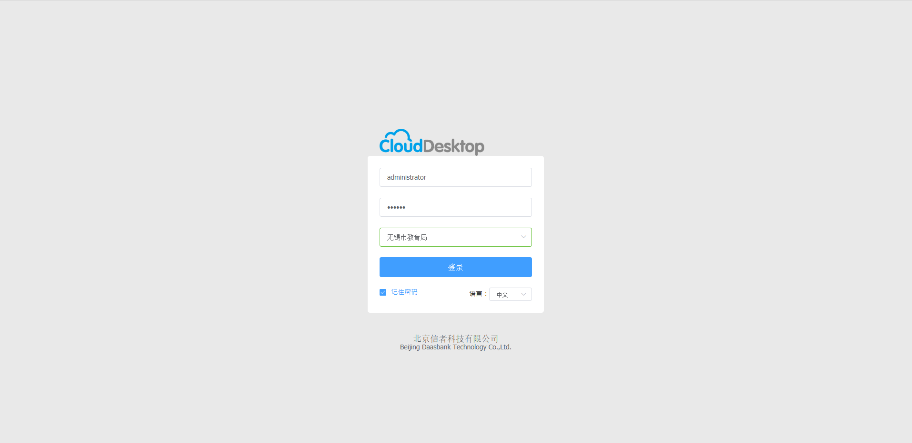
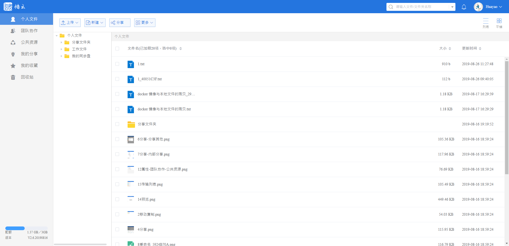
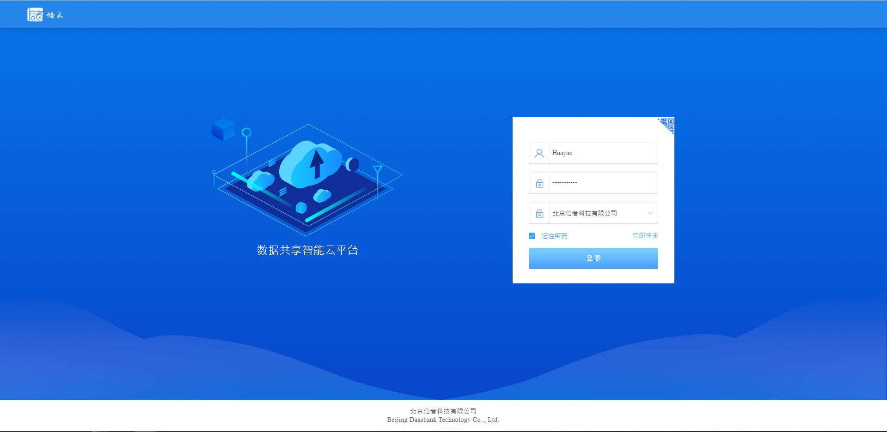

**CloudDesktop云桌面**软件定义智能工作站是信者凭借自主开发的桌面虚拟化和分布式分发技术，面向高校计算机学院、机械学院、信息工程学院等大规模教学桌面应用群体开发的桌面智能管理产品，产品发挥本地高端运算、集中策略管理、安全资产管控、全局状态监控等优势功能，以”云-边-端”架构着重解决跨校区/多教室架构下桌面终端维护难度大、使用状态不透明、资产统计不完善等管理难题。产品帮助用户突破PC繁琐运维、安全无防护的使用瓶颈，揉合云端虚拟化产品集中管理、透明管理等优势，是一套使用流畅体验、灵活配置交付应用、便捷管理运维、数据汇聚共享、投资成本最佳的融合解决方案。

**CloudShare智能储云**随着云计算技术的普及，各行各业都在进行云化转型。与此同时，人工智能技术日新月异，快速迭代，各种算法不断涌现和应用于实战。信者科技通过多年研发，与合作伙伴共同打造协同创新：“平台”+“生态”，实现客户、伙伴多方共赢，以满足业务的持续演进和发展创新需求；并通过采用创新型的统一分布式融合存储体系架构，支持多种协议，采用容器虚拟化、混合云、融合数据库等前沿技术，独立自主研发基于企业私有云、混合云的存储产品，满足企事业单位、高等院校、科研机构与合作伙伴之间文档分享、协作和管理，为企业数据智能服务保驾护航。

### 文档库包含智能储云v2.5.0 +云桌面v3.1.1Web端的安装说明和产品介绍。

CloudShare+CloudDesktop是一个融合版本,[产品安装包](https://github.com/XINZHEKEJI/CloudDesktop/releases),获取产品安装包之后.

按照 [产品部署和安装手册]( Zh-CN/智能储云与桌面B端融合版安装手册-power%20by%20信者科技.docx) 进行部署和安装.

安装过程中有任何问题，请提交PR联系我们！

成功完成安装，可以看到如下产品截图:

### CloudDesktop产品截图：

### CloudShare产品截图：

CloudShare+CloudDesktop融合版本涵盖如下组件模块：

--------------------------------------------------------------------------------------------------------------

### 服务器系统要求:

        系统版本：      Ubuntu 16.04服务器版本 --支持中文
        系统环境：      AspNet Core 2.1.300
      系统的内存：      64G及以上(程序所占空间  1G docker所占空间  10G)
      系统系统盘：      256G 
    系统网络带宽：      1000M
    
### 基础组件(开源的，集群)
 
    1.mysql数据库:3306                     -----关系数据库结构化数据(云桌面数据和网盘的管理信息  用户扩展信息  群组信息)
    2.consul服务:8500                      -----集群时路由跳转
    3.ElastaticSerach数据库:9200           -----网盘所有与文件相关数据  
    4.redis数据库:6379                     -----缓存数据   
    5.RabbitMq组件:15672                   -----消息总线（EventBus 即不同API服务之间通信）
    6.mongodb数据库:27017                  -----存储用户的授权信息
    7.zimg服务:4869                        -----图像存储
    8.nginx服务:9000                       -----文件下载 
    
### 模块服务的功能（顺序）
  
     1.RouteMapServer服务:13000                                  -----路由服务服务 
     2.IdentityServer服务:1941                                   -----用户授权服务
     3.UserSyncServer服务:1943                                   -----用户同步服务 
     4.SchedulServer服务：1945                                   -----请求调度服务
     5.OcelotServer服务: 1946                                    -----API网关服务
     6.Common_Web_Mgr：18080                                     -----用户配置管理中心

### 网盘相关服务
  
     7.MainServer服务：(18888,18889)                              -----负责登录，网盘 桌面的License  网盘的管理信息
     8.StoreServer服务：(8890，8891，8892(--群组配置服务+虚拟磁盘)) -----负责网盘的存储相关（/dsbox目录必须打通 ）
     9.FileLSnake服务:1947                                        -----单例服务（创建文件夹  头像处理）
     10.DsBox_WebClient:81                                       -----网盘的Web端
     11.DsBOx_PC端（NetFrameWork4.0开发）                         -----网盘的PC端
     12.DsBox_Mobile（安卓和苹果端）                               -----网盘的手机端
     13.DsBox_WxMobile（微信端）                                  -----网盘的微信端

### 分布式桌面服务
  
      14.DesktopServer服务:14000                                    -----分布式桌面API服务
      15.DesktopMqtt服务：10000                                     -----健康件API服务   
      16.Desktop_Web:80                                             -----分布式桌面的Web端
      17.Desktp_中间件（WindowsServer2012以上  NetFrameWork4.7.2）   -----B和C之间的代理

### mysql里面的数据库[3个数据库]
  
      1.Ds_RegServices                                      -----1张表存储所有的配置IP Port  UserId UserPwd  以及其他
      2.dsbox                                               -----导入脚本就行(39表)
      3.dsdesktop                                           -----导入脚本就行(22表   18个视图)

--------------------------------------------------------------------------------------------------------------

我们的产品支持一键脚本自动化安装，通过执行产品安装包里面的一键安装脚本会自动安装和执行上述组件,执行安装完毕之后,记得向我们提交注册码,
便于我们根据注册码给您提供商务授权文件.

产品安装完成之后，通过[CloudDesktop操作手册](Zh-CN/产品操作手册/CloudDesktop%20Guide%5Bv3.1.1%5D-power%20by%20XINZHEKEJI.pdf)以及[CloudShare操作手册](Zh-CN/产品操作手册/CloudShare%20Guide%5Bv2.5.0%5D-power%20by%20XINZHEKEJI.pdf)进行操作使用。

### 接下来:

  1.CloudSharev2.6Alpha版本已经发布，可以通过[CloudShre智能储云](https://github.com/XINZHEKEJI/CloudShare)获取新版本进行体验。
  
  2.CloudDesktopv3.1.2版本正在内部测试中,即将发布.
  
### 联系我们

Feel free to star or raise issue on [Github](https://github.com/XINZHEKEJI/CloudDocument).

北京信者科技有限公司| 产品部

Tel : 010 6170 5677   Fax : 010 6170 3884

地址 : 北京市海淀区翠湖南环路13号院北京协同创新研究院5号楼3层

网址：www.daasbank.com

北京信者科技有限公司是一家致力于智能云终端与融合数据应用的产品服务公司

 

 

